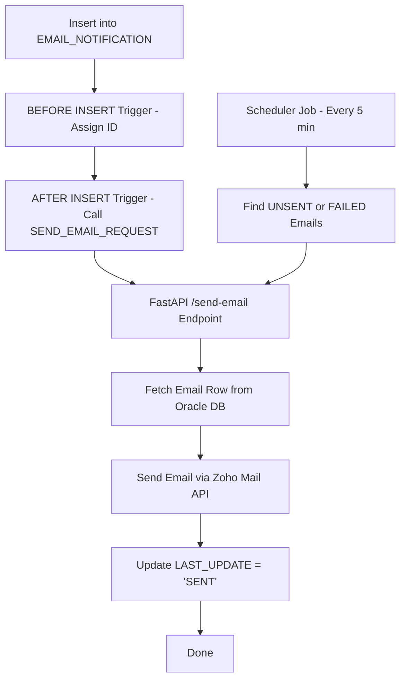

# 🚀 Automated Email Notification System

A fully automated, production-ready email delivery workflow integrating:

* **Oracle Database**
* **Oracle Triggers & Scheduler Jobs**
* **Python FastAPI Microservice**
* **Zoho Mail API (OAuth2)**

This system automatically sends emails when a new record is inserted into the Oracle table.
If an email fails, a scheduler job retries it automatically every 5 minutes.

---

# 📌 Features

### 🔹 Real-time automated email sending

Triggered instantly after an INSERT operation in Oracle.

### 🔹 Background retry scheduler

A DBMS Scheduler job reprocesses **FAILED** or **PENDING** emails every 5 minutes.

### 🔹 FastAPI microservice

Receives `email_id`, fetches data from Oracle, and sends email using Zoho Mail API.

### 🔹 Email capabilities

* HTML content
* CC / BCC
* File attachments (path-based)
* OAuth2 Zoho authentication

### 🔹 Database tracking

Updates:

* `LAST_UPDATE`
* `LAST_UPDATE_DATE`

---

# 📂 Folder Structure

```
automated-email-notification-system/
│
├── fastapi/
│   ├── app.py
│   ├── db.py
│   ├── email_sender.py
│   ├── .env.example
│   ├── requirements.txt
│   └── README.md
│
├── sql/
│   ├── email_notification.sql
│   ├── email_notificaion_seq.sql
│   ├── email_notification_trigger.sql
│   ├── email_notification_procedure.sql
│   ├── scheduler_pending_emails.sql
│   └── README.md
│
├── apex/
│   └── (APEX REST or documentation if any)
│
├── .env.example
├── .gitignore
└── README.md   ← this file
```

---

# 🧩 System Architecture

### ✔ GitHub-valid Mermaid diagram

(no `subgraph`, no unsupported syntax)



✔ This diagram renders perfectly on GitHub.

---

# 📬 Email Workflow (Step-by-Step)

### 1️⃣ Insert an email record

```sql
INSERT INTO EMAIL_NOTIFICATION (EMAIL, SUBJECT, MESSAGE)
VALUES ('test@example.com','Hello','<h2>Welcome</h2>');
```

### 2️⃣ BEFORE INSERT trigger assigns sequence ID

### 3️⃣ AFTER INSERT trigger runs:

```sql
SEND_EMAIL_REQUEST(:NEW.ID);
```

### 4️⃣ FastAPI receives:

```json
{ "email_id": 12 }
```

### 5️⃣ FastAPI fetches row → sends email via Zoho API

### 6️⃣ Updates:

```
LAST_UPDATE = 'SENT'
```

### 7️⃣ If failed:

```
LAST_UPDATE = 'FAILED'
```

### 8️⃣ Scheduler job retries failed emails every 5 minutes.

---

# 🛠 Oracle Components

### 📄 Table

`sql/email_notification.sql`

### 📄 Sequence

`sql/email_notificaion_seq.sql`

### 📄 Triggers

`sql/email_notification_trigger.sql`

### 📄 Procedure (calls FastAPI)

`sql/email_notification_procedure.sql`

### 📄 Scheduler (retry failed emails)

`sql/scheduler_pending_emails.sql`

---

# ⚙ FastAPI Microservice

Start API:

```bash
uvicorn app:app --host 0.0.0.0 --port 8000
```

### Endpoints:

| Method | URL           | Description                |
| ------ | ------------- | -------------------------- |
| GET    | `/`           | Health check               |
| POST   | `/send-email` | Sends email using email_id |

---

# 🔧 Environment Variables

`.env.example` (root or fastapi folder):

```
ORACLE_USER=
ORACLE_PASSWORD=
ORACLE_DSN=

ZOHO_CLIENT_ID=
ZOHO_CLIENT_SECRET=
ZOHO_REFRESH_TOKEN=
ZOHO_ACCOUNT_ID=
ZOHO_FROM_ADDRESS=
```

---

# 👤 Author

Developed by **Nayan Das**
Enterprise-grade automation with Oracle Database + FastAPI + Zoho API.