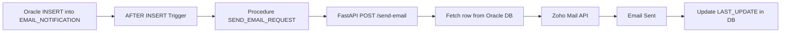

# 📧 FastAPI Email Notification Service

This is the backend microservice responsible for sending **automated email notifications** triggered from the **Oracle Database**.
The service receives an `email_id` from Oracle → fetches the email details → sends the email using **Zoho Mail API** → updates the status in the database.

It is a core part of the **Automated Email Notification System**.

---

## 🚀 Features

* Receives email requests from Oracle via FastAPI endpoint
* Fetches email row from `INTERN.EMAIL_NOTIFICATION` table
* Sends email via **Zoho Mail API** (using OAuth Refresh Token)
* Supports:

  * CC / BCC
  * HTML content
  * Attachments (path-based)
* Updates status in Oracle:

  * `SENT`
  * `FAILED`
* Uses Oracle connection pooling
* Clean `.env` environment-based configuration
* Production-ready architecture

---

# 📂 Folder Structure

```
fastapi/
│
├── app.py               # Main FastAPI application
├── db.py                # Oracle connection pool
├── email_sender.py      # Zoho email sending logic
├── .env.example         # Sample environment variables file
├── requirements.txt     # Python dependencies
└── README.md            # Documentation (this file)
```

---

# 🛠 Requirements

* Python 3.10+
* Oracle Instant Client 23c
* Oracle Database (remote or local)
* Valid Zoho Mail API credentials

---

# 🔧 Installation & Setup

### 1. Install dependencies

```bash
pip install -r requirements.txt
```

---

### 2. Configure environment variables

Create a `.env` file inside the `fastapi/` directory:

```env
# Oracle DB
ORACLE_USER=INTERN
ORACLE_PASSWORD=your_db_password
ORACLE_DSN=your_host:1521/your_service

# Zoho API Credentials
ZOHO_DC=com
ZOHO_CLIENT_ID=your_client_id
ZOHO_CLIENT_SECRET=your_client_secret
ZOHO_REFRESH_TOKEN=your_refresh_token
ZOHO_ACCOUNT_ID=your_account_id
ZOHO_FROM_ADDRESS=your_zohomail_address
```

⚠ **Never commit `.env` to GitHub. Use `.env.example` instead.**

---

### 3. Configure Oracle Instant Client in `db.py`

```python
oracledb.init_oracle_client(lib_dir=r"C:\oracle\instantclient_23_9")
```

Modify the path if needed.

---

### 4. Start the FastAPI server

```bash
uvicorn app:app --host 0.0.0.0 --port 8000
```

Server will run at:

```
http://localhost:8000
```

---

# 📬 How Oracle Calls This API

Oracle trigger calls:

```sql
SEND_EMAIL_REQUEST(:NEW.ID);
```

Which sends a POST request to:

```
POST /send-email
{
  "email_id": 7
}
```

FastAPI does:

1. Fetch row from table
2. Send email via Zoho
3. Update LAST_UPDATE & LAST_UPDATE_DATE

---

# 🧪 API Endpoints

### 🌐 **Health Check**

```
GET /
```

Response:

```json
{
  "status": "ok",
  "message": "Email notification service is running"
}
```

---

### 📤 **Send Email**

```
POST /send-email
```

Body:

```json
{
  "email_id": 5
}
```

Success Response:

```json
{
  "status": "sent",
  "email_id": 5
}
```

Failure Response:

```json
{
  "detail": "Error while sending email: <reason>"
}
```

---

# 📡 Email Sending Flow



---

# 🚨 Error Handling

* If email is sent → `LAST_UPDATE='SENT'`
* If email fails → `LAST_UPDATE='FAILED'`
* If email_id not found → 404 error
* All exceptions return FastAPI HTTPException messages

---

# 📌 Notes

* The service can be deployed on Linux/Windows
* Make sure Oracle ACL permits outbound HTTP requests
* Works perfectly with Oracle Autonomous DB, 11g, 12c, 19c, 21c, 23c